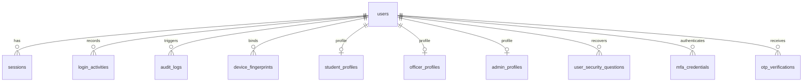

# Phase 1 Implementation Plan: Authentication & Security Architecture
**Project**: ST Seva Portal — AI-Powered ST Scholarship Certificate Verification System  
**Modules in Scope**: Module 1 (Features 1–13) & Module 15 (Features 140–148)  
**Standard**: GIGW Compliant (Guidelines for Indian Government Websites) / UMANG Design Language

---

## 1. Phase 1 Database Tables (SQLAlchemy 2.0 & PostgreSQL 15)

All PII fields marked with `[AES-256]` are encrypted at rest using AES-256-GCM with a master server key and PBKDF2/HKDF salt.



### Table 1: `users`
Core user identity and authentication credentials.
- `id` (UUID, Primary Key, default `gen_random_uuid()`)
- `mobile_number_hash` (VARCHAR(64), indexed, unique): HMAC-SHA256 for searching
- `mobile_number_enc` (BYTEA): `[AES-256]` encrypted mobile number
- `email` (VARCHAR(255), unique, indexed, nullable)
- `hashed_password` (VARCHAR(255), nullable)
- `role` (ENUM: `student`, `officer`, `admin`, `super_admin`, default `student`)
- `is_active` (BOOLEAN, default `TRUE`)
- `is_verified` (BOOLEAN, default `FALSE`)
- `aadhaar_hash` (VARCHAR(64), unique, indexed, nullable): HMAC-SHA256 for deduplication
- `aadhaar_enc` (BYTEA, nullable): `[AES-256]` encrypted Aadhaar reference/UIDAI vault token
- `digilocker_id` (VARCHAR(128), unique, indexed, nullable)
- `failed_login_attempts` (INTEGER, default 0)
- `locked_until` (TIMESTAMP WITH TIME ZONE, nullable)
- `created_at` (TIMESTAMP WITH TIME ZONE, default `now()`)
- `updated_at` (TIMESTAMP WITH TIME ZONE, default `now()`)

### Table 2: `sessions` (Features 9, 10, 140)
Multi-device session tracker with refresh token rotation.
- `id` (UUID, Primary Key)
- `user_id` (UUID, Foreign Key -> `users.id`, ON DELETE CASCADE)
- `refresh_token_hash` (VARCHAR(64), indexed, unique)
- `device_fingerprint_id` (UUID, Foreign Key -> `device_fingerprints.id`, nullable)
- `device_name` (VARCHAR(150)): e.g., "Chrome on Windows 11", "Safari on iOS"
- `ip_address` (INET)
- `location_estimate` (VARCHAR(150)): e.g., "Ranchi, Jharkhand, IN"
- `user_agent` (TEXT)
- `is_revoked` (BOOLEAN, default `FALSE`)
- `expires_at` (TIMESTAMP WITH TIME ZONE)
- `last_active_at` (TIMESTAMP WITH TIME ZONE, default `now()`)
- `created_at` (TIMESTAMP WITH TIME ZONE, default `now()`)

### Table 3: `device_fingerprints` (Features 143)
Hardware and browser fingerprinting for anomalous access detection.
- `id` (UUID, Primary Key)
- `user_id` (UUID, Foreign Key -> `users.id`, ON DELETE CASCADE)
- `fingerprint_hash` (VARCHAR(64), indexed): Canvas, WebGL, Screen, Audio, Timezone hash
- `device_type` (VARCHAR(50)): `desktop`, `mobile`, `tablet`
- `os` (VARCHAR(50))
- `browser` (VARCHAR(50))
- `is_trusted` (BOOLEAN, default `TRUE`)
- `first_seen_at` (TIMESTAMP WITH TIME ZONE, default `now()`)
- `last_seen_at` (TIMESTAMP WITH TIME ZONE, default `now()`)

### Table 4: `login_activities` (Features 13, 143)
Comprehensive audit trail of every login event.
- `id` (UUID, Primary Key)
- `user_id` (UUID, Foreign Key -> `users.id`, nullable)
- `auth_method` (VARCHAR(50)): `mobile_otp`, `email_password`, `digilocker`, `aadhaar_ekyc`
- `status` (VARCHAR(20)): `SUCCESS`, `FAILURE`, `CHALLENGE_REQUIRED`
- `failure_reason` (VARCHAR(255), nullable)
- `ip_address` (INET)
- `user_agent` (TEXT)
- `device_summary` (VARCHAR(150))
- `location` (VARCHAR(150))
- `is_new_device` (BOOLEAN, default `FALSE`)
- `created_at` (TIMESTAMP WITH TIME ZONE, default `now()`)

### Table 5: `otp_verifications` (Feature 1, 11, 12)
Cryptographically hashed OTP dispatch and attempt limiter.
- `id` (UUID, Primary Key)
- `identifier_hash` (VARCHAR(64), indexed): phone or email HMAC
- `purpose` (VARCHAR(50)): `login`, `registration`, `password_reset`, `recovery`, `mfa`
- `otp_code_hash` (VARCHAR(64)): salted SHA-256 of 6-digit OTP
- `attempts` (INTEGER, default 0)
- `max_attempts` (INTEGER, default 3)
- `is_used` (BOOLEAN, default `FALSE`)
- `expires_at` (TIMESTAMP WITH TIME ZONE)
- `created_at` (TIMESTAMP WITH TIME ZONE, default `now()`)

### Table 6: `student_profiles` (Feature 6, 141)
Demographics and banking info for ST applicants.
- `id` (UUID, Primary Key)
- `user_id` (UUID, Foreign Key -> `users.id`, unique, ON DELETE CASCADE)
- `full_name` (VARCHAR(150))
- `dob` (DATE)
- `gender` (VARCHAR(20))
- `category` (VARCHAR(50), default `Scheduled Tribe (ST)`)
- `sub_caste` (VARCHAR(100), nullable)
- `father_name` (VARCHAR(150), nullable)
- `mother_name` (VARCHAR(150), nullable)
- `annual_family_income` (NUMERIC(12, 2), nullable)
- `address_line1` (TEXT)
- `address_line2` (TEXT, nullable)
- `district` (VARCHAR(100))
- `state` (VARCHAR(100))
- `pincode` (VARCHAR(10))
- `bank_name` (VARCHAR(100), nullable)
- `bank_account_enc` (BYTEA, nullable): `[AES-256]`
- `bank_ifsc` (VARCHAR(20), nullable)
- `bank_branch` (VARCHAR(100), nullable)
- `institution_name` (VARCHAR(200), nullable)
- `institution_code_aishe` (VARCHAR(50), nullable)
- `course_name` (VARCHAR(100), nullable)
- `current_year_of_study` (INTEGER, nullable)
- `avatar_url` (TEXT, nullable)
- `created_at` (TIMESTAMP WITH TIME ZONE, default `now()`)
- `updated_at` (TIMESTAMP WITH TIME ZONE, default `now()`)

### Table 7: `officer_profiles` (Feature 7)
Verification officer profile and jurisdictional scope.
- `id` (UUID, Primary Key)
- `user_id` (UUID, Foreign Key -> `users.id`, unique, ON DELETE CASCADE)
- `full_name` (VARCHAR(150))
- `designation` (VARCHAR(100)): e.g., "District Welfare Officer (DWO)", "Assistant Director"
- `department` (VARCHAR(150), default "Tribal Welfare Department")
- `state` (VARCHAR(100))
- `district` (VARCHAR(100))
- `office_address` (TEXT)
- `employee_id` (VARCHAR(50), unique)
- `assigned_schemes` (JSONB, default `[]`): e.g., `["ST_PRE_MATRIC", "ST_POST_MATRIC", "NATIONAL_FELLOWSHIP_ST"]`
- `created_at` (TIMESTAMP WITH TIME ZONE, default `now()`)
- `updated_at` (TIMESTAMP WITH TIME ZONE, default `now()`)

### Table 8: `admin_profiles` (Feature 8)
Administrative personnel profile with elevated privileges.
- `id` (UUID, Primary Key)
- `user_id` (UUID, Foreign Key -> `users.id`, unique, ON DELETE CASCADE)
- `full_name` (VARCHAR(150))
- `admin_level` (VARCHAR(50)): `STATE_ADMIN`, `NATIONAL_ADMIN`, `SUPER_ADMIN`
- `jurisdiction` (VARCHAR(100)): e.g., "All India" or specific State
- `contact_email` (VARCHAR(255))
- `created_at` (TIMESTAMP WITH TIME ZONE, default `now()`)

### Table 9: `audit_logs` (Feature 144)
Tamper-resistant audit trail with hash chaining.
- `id` (UUID, Primary Key)
- `user_id` (UUID, Foreign Key -> `users.id`, nullable)
- `action` (VARCHAR(100)): e.g., `USER_LOGIN`, `PASSWORD_CHANGE`, `SESSION_REVOKE`, `PROFILE_UPDATE`
- `resource_type` (VARCHAR(50)): e.g., `USER`, `SESSION`, `SECURITY_SETTINGS`
- `resource_id` (VARCHAR(100), nullable)
- `details` (JSONB, default `{}`)
- `ip_address` (INET)
- `user_agent` (TEXT)
- `previous_log_hash` (VARCHAR(64)): Hash chain link for immutability
- `entry_hash` (VARCHAR(64)): SHA-256 of (`id + action + timestamp + previous_log_hash`)
- `created_at` (TIMESTAMP WITH TIME ZONE, default `now()`)

### Table 10: `mfa_credentials` (Feature 148)
TOTP authenticator secret and backup recovery codes.
- `id` (UUID, Primary Key)
- `user_id` (UUID, Foreign Key -> `users.id`, unique, ON DELETE CASCADE)
- `totp_secret_enc` (BYTEA): `[AES-256]` encrypted RFC 6238 Base32 secret
- `is_enabled` (BOOLEAN, default `FALSE`)
- `backup_codes_hash` (JSONB, default `[]`): List of SHA-256 hashed 8-character recovery codes
- `confirmed_at` (TIMESTAMP WITH TIME ZONE, nullable)
- `created_at` (TIMESTAMP WITH TIME ZONE, default `now()`)

### Table 11: `account_recovery_questions` & `user_recovery_answers` (Feature 12)
Secondary recovery fallback questions with bcrypt hashed answers.
- `id` (UUID, Primary Key)
- `user_id` (UUID, Foreign Key -> `users.id`, ON DELETE CASCADE)
- `question_key` (VARCHAR(100))
- `answer_hash` (VARCHAR(255)): Salted bcrypt hash of normalized lowercase answer
- `created_at` (TIMESTAMP WITH TIME ZONE, default `now()`)

---

## 2. Phase 1 API Endpoints (FastAPI)

All endpoints prefixed with `/api/v1`.

### Authentication Endpoints (`/api/v1/auth`)
| Method | Endpoint | Description | Auth Required | Rate Limit |
|---|---|---|---|---|
| `POST` | `/auth/otp/send` | Request 6-digit OTP to mobile or email | Public | 3 req / 2 min |
| `POST` | `/auth/otp/verify` | Verify OTP, generate session & JWT tokens | Public | 5 req / 2 min |
| `POST` | `/auth/login/email` | Password login (+ TOTP challenge if enabled) | Public | 5 req / min |
| `POST` | `/auth/refresh` | Token rotation: issue new Access Token & Refresh Token | Public (Bearer) | 20 req / min |
| `POST` | `/auth/logout` | Revoke current session & invalidate refresh token | Authenticated | 10 req / min |
| `GET` | `/auth/digilocker/authorize` | Initiates DigiLocker OAuth 2.0 PKCE flow | Public | 10 req / min |
| `GET` | `/auth/digilocker/callback` | Handles DigiLocker code exchange & account link | Public | 10 req / min |
| `POST` | `/auth/aadhaar/ekyc-init` | Sandbox UIDAI OTP generation stub | Authenticated | 3 req / 5 min |
| `POST` | `/auth/aadhaar/ekyc-verify` | Verify Aadhaar OTP stub & link profile | Authenticated | 3 req / 5 min |
| `POST` | `/auth/password/reset-request` | Sends password reset email link | Public | 3 req / 10 min |
| `POST` | `/auth/password/reset-confirm` | Validates reset token and sets new password | Public | 3 req / 10 min |
| `POST` | `/auth/recovery/challenge` | Fetch recovery questions for user | Public | 5 req / 5 min |
| `POST` | `/auth/recovery/verify` | Verify recovery answers and issue temp token | Public | 3 req / 5 min |

### Profile Management (`/api/v1/profile`)
| Method | Endpoint | Description | Auth Required |
|---|---|---|---|
| `GET` | `/profile/me` | Fetch active user credentials and role-specific profile | Authenticated |
| `PUT` | `/profile/student` | Update student demographics, institute, and bank details | Student / Admin |
| `PUT` | `/profile/officer` | Update officer details, designation, assigned schemes | Officer / Admin |
| `PUT` | `/profile/admin` | Update admin profile details | Admin / Super Admin |
| `POST` | `/profile/avatar` | Upload profile image (virus checked, encrypted in MinIO) | Authenticated |

### Multi-device & Session Management (`/api/v1/sessions`)
| Method | Endpoint | Description | Auth Required |
|---|---|---|---|
| `GET` | `/sessions/active` | List all active sessions with device & IP info | Authenticated |
| `DELETE` | `/sessions/:id` | Revoke a specific active session | Authenticated |
| `DELETE` | `/sessions/revoke-others` | Revoke all sessions except the current one | Authenticated |
| `GET` | `/sessions/history` | Paginated login activity audit log | Authenticated |

### Security & System Administration (`/api/v1/security`)
| Method | Endpoint | Description | Auth Required |
|---|---|---|---|
| `POST` | `/security/mfa/setup` | Generate TOTP QR code and setup secret | Authenticated |
| `POST` | `/security/mfa/enable` | Confirm TOTP code and return backup codes | Authenticated |
| `POST` | `/security/mfa/disable` | Disable TOTP with password/code verification | Authenticated |
| `GET` | `/security/audit-logs` | Query system audit logs with filters | Admin / Super Admin |
| `POST` | `/security/backup/trigger` | Trigger manual Postgres dump to MinIO | Super Admin |
| `GET` | `/security/backup/status` | Get last backup snapshot and retention details | Admin / Super Admin |
| `POST` | `/security/recovery/set-questions` | Set or update 3 security recovery questions | Authenticated |

---

## 3. Phase 1 Frontend Pages & Components (React 18 + Vite + Tailwind CSS)

### UMANG / GIGW Indian Government Aesthetics Specifications:
1. **Accessibility Top Bar**:
   - Screen Reader Access toggle
   - Skip to Main Content (`#main-content`)
   - Font size adjuster: `A-` (14px), `A` (16px), `A+` (18px)
   - Color Mode: Standard Theme, Dark Mode, High Contrast Mode (WCAG AAA compliant: stark black background `#000000`, vibrant yellow `#FFFF00` accents and `#FFFFFF` text)
   - Language selector dropdown (English, हिन्दी)
2. **Government Header**:
   - State Emblem of India (Ashoka Lion Capital)
   - "जनजातीय कार्य मंत्रालय / Ministry of Tribal Affairs, Government of India"
   - Official portal branding: **ST Seva Portal** (Scholarship & Fellowship Management System)
   - Digital India & UMANG emblem integration
   - Navigation links: Home, About Schemes, DigiLocker Services, Grievance, Contact Us, Login/Register
3. **National Portal Hero & Live Data Strip**:
   - Official tri-color subtle accent strip (Deep Saffron `#FF9933`, White `#FFFFFF`, India Green `#138808`)
   - Live metrics bar: Verified ST Beneficiaries, Total DBT Disbursed, Active Schemes, State/UT Coverage
4. **Authentic Government Footer**:
   - Portal management credits: National Informatics Centre (NIC) / National e-Governance Division (NeGD)
   - Important Links: CPGRAMS, MyGov, India.gov.in, DigiLocker, MoTA Official
   - Live Visitor Counter, Last Updated Date, Release Version tag (v1.0.0-PROD)

### Phase 1 Route Hierarchy:
- `/` — Official ST Seva Portal Landing Page with GIGW header, statistics, scheme announcements, and login quick-launch.
- `/login` — Unified Government Auth Hub:
  - Tab 1: **Mobile OTP Login** (SMS 6-digit OTP with 30s resend timer)
  - Tab 2: **Password / Email Login** (+ TOTP step if enabled)
  - Tab 3: **DigiLocker Login** (Official sandbox redirect simulation)
  - Tab 4: **Officer / Admin SSO Login**
- `/register` — ST Student Registration Wizard (Mobile OTP verification, basic credentials, Aadhaar consent declaration)
- `/verify-otp` — Standalone OTP verification screen with auto-pasting and countdown
- `/forgot-password` — Password recovery via secure email token or security question fallback
- `/account-recovery` — 3-Tier security question challenge + backup phone OTP
- `/dashboard` — Role-based router:
  - `/student/profile` — Full ST Student Profile Editor (Demographics, Academic, Bank details with IFSC auto-lookup)
  - `/officer/profile` — Officer Jurisdictional Dashboard & Active Scheme allocation
  - `/admin/profile` — System Administrator console
- `/security/sessions` — Active Device Management (Device fingerprint, IP, Location, "Revoke Session" action)
- `/security/mfa` — Google Authenticator / TOTP Setup wizard with QR code and emergency recovery codes
- `/security/audit-logs` — Tamper-evident activity trail for users and administrators

---

## 4. AI & Security Engineering Details for Phase 1

### A. AES-256-GCM Cryptographic Storage (Feature 141)
- **Standard**: AES-GCM 256-bit encryption with random 96-bit IV per row and authentication tag.
- **Fields Encrypted**:
  - `users.aadhaar_enc`
  - `users.mobile_number_enc`
  - `student_profiles.bank_account_enc`
  - `mfa_credentials.totp_secret_enc`
- **Blind Indexing**: To allow lookups without decrypting the entire database, deterministic HMAC-SHA256 hashes (`mobile_number_hash`, `aadhaar_hash`) are stored in indexed columns with a pepper key.

### B. Device Fingerprinting & Anomaly Detection (Feature 143)
- Client collects non-PII hardware metrics: Screen resolution, color depth, canvas signature, WebGL vendor/renderer, audio latency fingerprint, timezone, hardware concurrency.
- Client passes `X-Device-Fingerprint` header.
- Server validates against `device_fingerprints` table.
- If a new device is detected:
  1. Flagged as `is_new_device = True` in `login_activities`.
  2. Audit log entry created.
  3. Automatic notification alert dispatched.

### C. Rate Limiting & Brute-Force Prevention (Feature 142)
- Redis / Memory sliding-window rate limiter per client IP + Endpoint.
- Public OTP endpoints capped at 3 requests per 2 minutes.
- Failed password login triggers incremental backoff (3 attempts = 5 min lock, 5 attempts = 30 min lock).

### D. Audit Logging with Cryptographic Hash Chaining (Feature 144)
- Every audit entry stores the SHA-256 hash of the previous log record (`previous_log_hash`).
- Generates a tamper-evident blockchain-like chain in PostgreSQL: any alteration of past logs invalidates the chain.

---

## 5. Phase 1 Test Plan

| Test ID | Test Category | Target Feature | Validation Criteria |
|---|---|---|---|
| **T1.1** | Unit / Backend | Password Hashing | Verify passlib/bcrypt with salt rounds >= 12 |
| **T1.2** | Unit / Backend | AES-256 GCM Service | Encrypt and decrypt Aadhaar, phone, bank account; verify tamper detection with modified ciphertext |
| **T1.3** | Integration / API | Mobile OTP Flow | Send OTP -> verify record in `otp_verifications` -> verify correct OTP yields JWT -> verify bad OTP increments failed attempts |
| **T1.4** | Integration / API | JWT Rotation | Use refresh token to obtain new access token; ensure old refresh token is invalidated |
| **T1.5** | Integration / API | Rate Limiter | Send 5 requests in 10s to `/auth/otp/send`; verify HTTP 429 Too Many Requests |
| **T1.6** | Security | Role-Based Access Control | Attempt accessing `/security/audit-logs` as `student`; verify HTTP 403 Forbidden |
| **T1.7** | Integration / API | TOTP MFA | Generate secret, verify QR code generation, confirm with valid OTP, verify subsequent login requires MFA step |
| **T1.8** | Integration / API | Session Revocation | Log in from 2 sessions; revoke session 1 from session 2; verify session 1 token is immediately rejected |
| **T1.9** | Frontend / E2E | Accessibility (WCAG AAA) | Toggle High Contrast Mode, verify color contrast ratio >= 7:1; test font scaling A-/A/A+ |
| **T1.10** | Frontend / E2E | Browser Walkthrough | Chrome subagent walkthrough of Login, OTP verification, Profile update, Device session list, and MFA setup |

---

## 6. Estimated File List for Phase 1

### Backend (`/backend`)
```
backend/
├── app/
│   ├── __init__.py
│   ├── main.py                          # FastAPI application initialization & middleware
│   ├── config.py                        # App configuration & environment variables
│   ├── core/
│   │   ├── security.py                  # JWT encoding/decoding, password hashing
│   │   ├── crypto.py                    # AES-256-GCM encryption & HMAC blind indexing
│   │   ├── rate_limit.py                # Redis/in-memory rate limiter middleware
│   │   └── audit.py                     # Tamper-evident audit logging service
│   ├── db/
│   │   ├── session.py                   # SQLAlchemy engine, session maker & base model
│   │   ├── init_db.py                   # Schema initialization & seed data (default admin/officer)
│   │   └── models/
│   │       ├── user.py                  # User, Role enum, Account recovery models
│   │       ├── session.py               # Multi-device session & fingerprint models
│   │       ├── profile.py               # Student, Officer, Admin profile models
│   │       ├── security.py              # MFA credentials, OTP verification models
│   │       └── audit.py                 # Tamper-evident audit log models
│   ├── schemas/
│   │   ├── auth.py                      # Login, OTP, JWT, Reset request/response Pydantic models
│   │   ├── profile.py                   # Student, Officer, Admin profile schemas
│   │   ├── session.py                   # Active sessions & login activity schemas
│   │   └── security.py                  # MFA setup, Audit query, Backup schemas
│   ├── api/
│   │   ├── deps.py                      # FastAPI dependency injection (get_current_user, check_role)
│   │   └── v1/
│   │       ├── api.py                   # API router aggregation
│   │       ├── endpoints/
│   │       │   ├── auth.py              # OTP, Email, DigiLocker, Aadhaar stub endpoints
│   │       │   ├── profile.py           # Profile management endpoints
│   │       │   ├── sessions.py          # Session and device management endpoints
│   │       │   └── security.py          # MFA, Audit, Rate-limit, Backup endpoints
│   └── services/
│       ├── otp_service.py               # Simulated SMS/MSG91 dispatch & validation
│       ├── digilocker_service.py        # DigiLocker OAuth sandbox integration
│       └── backup_service.py            # PostgreSQL dump to MinIO / local storage
├── requirements.txt                     # Backend dependencies
└── Dockerfile                           # Production container setup
```

### Frontend (`/frontend`)
```
frontend/
├── index.html                           # GIGW-compliant meta tags, fonts, accessibility hooks
├── vite.config.js                       # Vite configuration with proxy to FastAPI backend
├── tailwind.config.js                   # Government color palette, high-contrast & dark mode rules
├── package.json                         # React 18, Lucide icons, Tailwind, Axios
├── src/
│   ├── main.jsx                         # React root with ThemeProvider & AuthProvider
│   ├── App.jsx                          # Main routing & layout wrapper
│   ├── index.css                        # Tailwind directives & high-contrast accessibility styles
│   ├── context/
│   │   ├── AuthContext.jsx              # Global user session & token refresh state
│   │   └── AccessibilityContext.jsx     # High contrast, font scaling (A-/A/A+), sound/screen reader
│   ├── components/
│   │   ├── layout/
│   │   │   ├── TopAccessibilityBar.jsx  # GIGW bar: Screen reader, contrast, font, language
│   │   │   ├── GovHeader.jsx            # Ashoka emblem, MoTA header, UMANG styling
│   │   │   ├── GovNavbar.jsx            # Official navigation tabs with active indicators
│   │   │   ├── GovFooter.jsx            # NeGD, MyGov, India.gov.in badges, visitor count
│   │   │   └── ProtectedRoute.jsx       # RBAC role guards
│   │   └── ui/
│   │       ├── GovButton.jsx            # Accessible high-visibility government buttons
│   │       ├── GovInput.jsx             # Accessible labeled input fields
│   │       ├── StatCard.jsx             # Central/State statistics display
│   │       └── Modal.jsx                # Accessible dialogs
│   ├── pages/
│   │   ├── LandingPage.jsx              # Realistic UMANG-style home with live stats & announcements
│   │   ├── auth/
│   │   │   ├── LoginPage.jsx            # Unified login (Mobile OTP, Email, DigiLocker, Officer SSO)
│   │   │   ├── RegisterPage.jsx         # ST Student registration with OTP check
│   │   │   ├── VerifyOtpPage.jsx        # Dedicated OTP confirmation view
│   │   │   ├── ForgotPasswordPage.jsx   # Reset link dispatch
│   │   │   └── AccountRecoveryPage.jsx  # Security question challenge
│   │   ├── profile/
│   │   │   ├── StudentProfilePage.jsx   # Demographics, academic, bank details with IFSC check
│   │   │   ├── OfficerProfilePage.jsx   # Officer jurisdiction & assigned schemes
│   │   │   └── AdminProfilePage.jsx     # System administrator profile
│   │   └── security/
│   │       ├── ActiveSessionsPage.jsx   # Device list, IP location, revoke buttons
│   │       ├── MfaSetupPage.jsx         # Google Authenticator QR setup & recovery codes
│   │       └── AuditLogsPage.jsx        # Tamper-evident activity inspection
│   └── services/
│       ├── api.js                       # Axios instance with auto JWT bearer injection & 401 refresh
│       ├── authService.js               # Auth API methods
│       └── profileService.js            # Profile and security API methods
```
