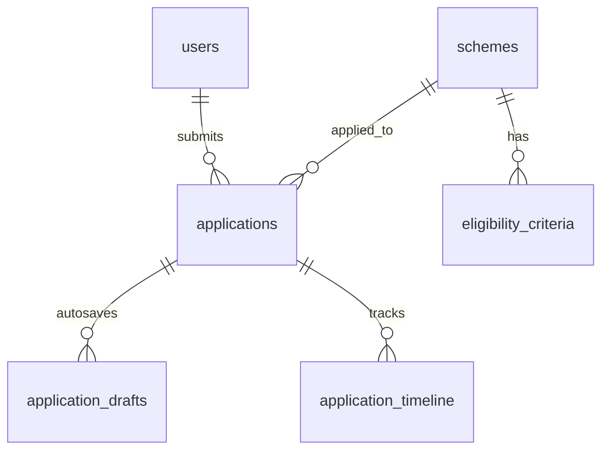

# Phase 2 Implementation Plan: Student Application Portal
**Project**: ST Seva Portal — AI-Powered ST Scholarship Certificate Verification System  
**Module in Scope**: Module 2: Student Application Portal (Features 14–26)  
**Standard**: GIGW Compliant (Guidelines for Indian Government Websites) / UMANG Design System  

---

## 1. Phase 2 Database Tables (SQLAlchemy 2.0 & PostgreSQL / SQLite)

### Table 1: `schemes` (Features 14, 21, 22)
Official Ministry of Tribal Affairs (MoTA) scholarship and fellowship schemes.
- `id` (VARCHAR(50), Primary Key): e.g., `ST_PRE_MATRIC`, `ST_POST_MATRIC`, `NATIONAL_FELLOWSHIP_ST`, `TOP_CLASS_EDUCATION_ST`
- `scheme_name` (VARCHAR(255), nullable=False)
- `scheme_code` (VARCHAR(50), unique, nullable=False): e.g., `MTA-PMS-2026`
- `scheme_type` (VARCHAR(50)): `CENTRAL_SECTOR`, `CENTRALLY_SPONSORED`
- `education_level` (VARCHAR(50)): `SECONDARY`, `HIGHER_SECONDARY`, `UNDERGRADUATE`, `POSTGRADUATE`, `RESEARCH`
- `financial_assistance_details` (TEXT): Maintenance allowance, books grant, tuition fee coverage
- `max_family_income` (NUMERIC(12, 2)): e.g., 250000.00
- `academic_year` (VARCHAR(20)): `2026-2027`
- `application_start_date` (DATE)
- `application_deadline` (DATE)
- `is_active` (BOOLEAN, default=True)
- `guidelines_url` (TEXT, nullable=True)

### Table 2: `applications` (Features 14, 17, 19, 20, 25, 26)
Primary scholarship application submissions.
- `id` (VARCHAR(36), Primary Key, default UUID)
- `application_number` (VARCHAR(30), unique, index=True): `ST-2026-XXXXXX`
- `student_id` (VARCHAR(36), Foreign Key -> `users.id`, nullable=False)
- `scheme_id` (VARCHAR(50), Foreign Key -> `schemes.id`, nullable=False)
- `academic_year` (VARCHAR(20), default "2026-2027")
- `status` (VARCHAR(30), default "DRAFT"): `DRAFT`, `SUBMITTED`, `UNDER_SCRUTINY`, `DEFICIENT`, `APPROVED`, `REJECTED`, `WITHDRAWN`
- `is_locked` (BOOLEAN, default=False)
- `submission_date` (TIMESTAMP WITH TIME ZONE, nullable=True)
- `application_data` (JSON, default=dict): Structured snapshot of demographics, income, institute, bank account, and declarations at submission
- `withdrawal_reason` (TEXT, nullable=True)
- `withdrawn_at` (TIMESTAMP WITH TIME ZONE, nullable=True)
- `rejection_reason` (TEXT, nullable=True)
- `cloned_from_id` (VARCHAR(36), nullable=True): References previous application if cloned
- `created_at` (TIMESTAMP WITH TIME ZONE, default=now())
- `updated_at` (TIMESTAMP WITH TIME ZONE, default=now())

### Table 3: `application_drafts` (Features 15, 16)
Draft auto-save state updated every 30 seconds.
- `id` (VARCHAR(36), Primary Key, default UUID)
- `student_id` (VARCHAR(36), Foreign Key -> `users.id`, nullable=False)
- `scheme_id` (VARCHAR(50), Foreign Key -> `schemes.id`, nullable=False)
- `current_step` (INTEGER, default=1): Active wizard step (1 to 4)
- `draft_data` (JSON, default=dict): Incremental form fields
- `last_saved_at` (TIMESTAMP WITH TIME ZONE, default=now())

### Table 4: `application_timeline` (Features 23, 25, 26)
Auditable, visual status change events.
- `id` (VARCHAR(36), Primary Key, default UUID)
- `application_id` (VARCHAR(36), Foreign Key -> `applications.id`, nullable=False)
- `stage` (VARCHAR(50)): `DRAFT_SAVED`, `APPLICATION_SUBMITTED`, `DEFICIENCY_FLAGGED`, `CORRECTIONS_SUBMITTED`, `INSTITUTE_VERIFIED`, `OFFICER_APPROVED`, `REJECTED`, `WITHDRAWN`
- `title` (VARCHAR(150))
- `description` (TEXT, nullable=True)
- `actor_role` (VARCHAR(30)): `STUDENT`, `INSTITUTION`, `WELFARE_OFFICER`, `ADMIN`, `SYSTEM`
- `created_at` (TIMESTAMP WITH TIME ZONE, default=now())

---

## 2. Phase 2 API Endpoints (`/api/v1/applications` & `/api/v1/schemes`)

| Method | Endpoint | Description | Target Feature |
|---|---|---|---|
| `GET` | `/schemes` | List all official MoTA scholarship schemes with status & deadlines | Feature 14 |
| `GET` | `/schemes/{id}` | Detailed scheme guidelines, eligibility rules, and financial grant info | Feature 14 |
| `POST` | `/schemes/{id}/check-eligibility` | Automated pre-check of student profile (income, category, level) | Feature 22 |
| `POST` | `/applications/draft` | Save or auto-save incomplete form state (debounced 30s) | Features 15, 16 |
| `GET` | `/applications/draft/{scheme_id}` | Retrieve stored draft for student to resume | Features 15, 17 |
| `POST` | `/applications/submit` | Final submission, lock form, generate tracking number (`ST-2026-XXXXXX`) | Feature 19 |
| `GET` | `/applications` | List all submitted and draft applications for current student | Features 14, 21 |
| `GET` | `/applications/{id}` | Retrieve single application for read-only preview or status inspection | Feature 18 |
| `PUT` | `/applications/{id}` | Full edit of application before final submission | Feature 17 |
| `POST` | `/applications/{id}/clone` | Copy previous application details as base for a new scheme | Feature 20 |
| `POST` | `/applications/multi-apply` | Apply to multiple eligible schemes in a single session | Feature 21 |
| `GET` | `/applications/{id}/timeline` | Visual chronological timeline of all status changes | Feature 23 |
| `GET` | `/applications/{id}/export-pdf` | Download official PDF copy of submitted government application form | Feature 24 |
| `POST` | `/applications/{id}/withdraw` | Withdraw submitted application with mandatory justification | Feature 25 |
| `POST` | `/applications/{id}/reapply` | Reapply after rejection with pre-filled previous data | Feature 26 |

---

## 3. Phase 2 Frontend Pages & Components (UMANG / GIGW UI)

### New Pages:
1. `/applications` — **Student Applications Management Hub**:
   - Status filters (`All`, `Drafts`, `Submitted`, `Under Scrutiny`, `Approved`, `Withdrawn`)
   - Application tracking cards with tracking ID, scheme name, submission date, and status badges
   - Quick action buttons: `Preview Form`, `Track Timeline`, `Export PDF`, `Withdraw Application`, `Reapply`
2. `/applications/new` — **Multi-Step Application Wizard**:
   - **Step 1: Scheme Selection & Eligibility Pre-Check** (Real-time check against ST category and income)
   - **Step 2: Basic & Academic Information** (Institution AISHE code, course, current year, previous percentage)
   - **Step 3: Direct Benefit Transfer (DBT) Bank Account** (Verified AES-256 masked account and IFSC)
   - **Step 4: Declarations & Auto-Save Indicator** (Live indicator showing *"Draft saved automatically 12s ago"*)
3. `/applications/:id/preview` — **Government Application Form Read-Only Preview**:
   - GIGW-style formatted government application with Ashoka emblem watermark
   - "Edit Details" or "Confirm & Lock Application" actions
4. `/applications/:id/timeline` — **Visual Status Timeline Screen**:
   - Step-by-step graphical progress tracker matching UMANG's application tracking flow:
     - `Application Submitted` ➔ `Scrutiny by District Welfare Officer` ➔ `Institute Verification` ➔ `Approval & DBT Sanction`

---

## 4. Key Engineering & Security Highlights for Phase 2

- **30-Second Auto-Save Mechanism (Feature 16)**:
  - React hook debounces form mutations and fires background `POST /applications/draft` every 30 seconds without blocking user input.
- **Application Tracking Number Generator (Feature 19)**:
  - Cryptographically secure sequence: `ST-2026-{RANDOM_ALPHANUMERIC_6}` (e.g., `ST-2026-K92D4P`).
- **Eligibility Pre-Check Engine (Feature 22)**:
  - Checks:
    1. Social Category == `Scheduled Tribe (ST)`
    2. Family Annual Income <= Scheme ceiling (e.g. ₹ 2,50,000)
    3. Academic level compatibility (Secondary vs College vs Ph.D)
- **Immutable Application Lock (Feature 19)**:
  - Once submitted, `is_locked = True`. Updates to submitted forms are forbidden unless flagged for deficiency by an officer in Module 9.
- **Application PDF Export (Feature 24)**:
  - Generates downloadable printable summary with tracking barcode/QR stub, seal, and timestamps.

---

## 5. Phase 2 Test Plan

| Test ID | Test Category | Target Feature | Validation Criteria |
|---|---|---|---|
| **T2.1** | Unit | Scheme Seeding | Verify 4 MoTA schemes (Pre-Matric, Post-Matric, NFST, NOS) are seeded with rules |
| **T2.2** | Integration | Eligibility Pre-Check | Submit income ₹1.5L (Pass) vs ₹5.0L (Fail) for Pre-Matric; verify rules check |
| **T2.3** | Integration | Draft & Auto-Save | Save incomplete form state; verify retrieval via `GET /applications/draft/{id}` |
| **T2.4** | Integration | Final Submission | Submit application; verify `status = SUBMITTED`, `is_locked = True`, tracking ID generated |
| **T2.5** | Integration | Multi-Scheme Apply | Apply to 2 schemes; verify 2 separate tracking numbers linked to student |
| **T2.6** | Integration | Application Cloning | Clone submitted application; verify new draft populated with same academic data |
| **T2.7** | Integration | Visual Timeline | Record status progression; verify all stages in `GET /applications/{id}/timeline` |
| **T2.8** | Integration | Application Withdrawal | Withdraw application; verify `status = WITHDRAWN` with justification |
| **T2.9** | Integration | PDF Export | Verify `GET /applications/{id}/export-pdf` returns printable document |
| **T2.10** | UI / E2E | Browser Walkthrough | Fill application wizard in UI, test auto-save, submit, view timeline, and export |

---

## 6. Estimated File List for Phase 2

### Backend Files:
- `backend/app/db/models/scheme.py` — `Scheme`, `EligibilityCriteria` models
- `backend/app/db/models/application.py` — `Application`, `ApplicationDraft`, `ApplicationTimeline` models
- `backend/app/schemas/scheme.py` — Scheme schemas & eligibility request/response
- `backend/app/schemas/application.py` — Application wizard, draft, submission, withdrawal schemas
- `backend/app/api/v1/endpoints/schemes.py` — Schemes list and eligibility check endpoints
- `backend/app/api/v1/endpoints/applications.py` — Application wizard, auto-save, submit, clone, timeline, withdraw, reapply
- `backend/app/services/pdf_service.py` — Application PDF generator service
- `backend/tests/test_phase2.py` — Automated tests for Phase 2

### Frontend Files:
- `frontend/src/pages/applications/ApplicationsListPage.jsx` — Applications tracking hub
- `frontend/src/pages/applications/NewApplicationWizard.jsx` — Multi-step wizard with 30s auto-save
- `frontend/src/pages/applications/ApplicationPreviewPage.jsx` — Official read-only preview before submit
- `frontend/src/pages/applications/ApplicationTimelinePage.jsx` — Visual chronological timeline
- `frontend/src/services/applicationService.js` — Application API integration
