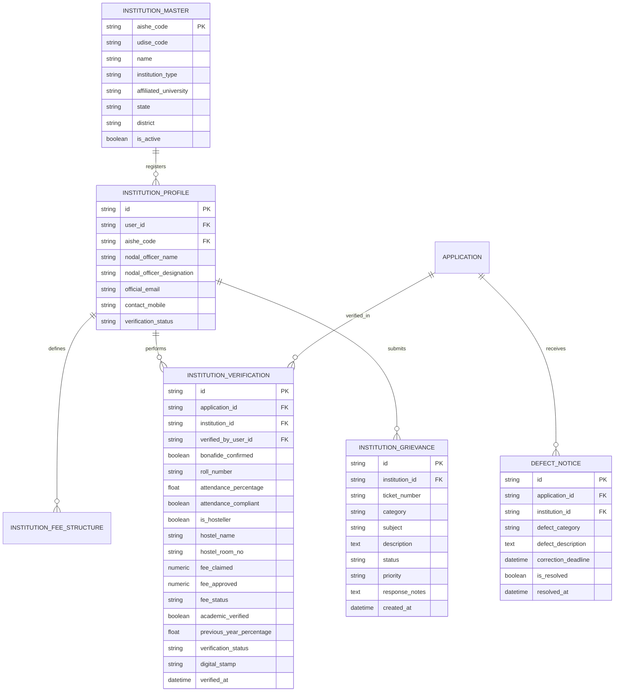

# Phase 4 Implementation Plan: Institutional Verification Portal (Module 4, Features 37–47)

## Executive Summary
Phase 4 implements the **Institutional Verification Portal** for educational institutions (Colleges, Universities, Higher Secondary Schools, and Polytechnics) participating in the ST Scholarship disbursement ecosystem. Educational institutions are the foundational verification tier: before district welfare officers or the Ministry review an ST scholarship application, the **Institutional Nodal Officer (INO)** must confirm student bonafide status, enforce the Ministry's **75% minimum attendance rule**, match claimed fees against approved fee structures, verify hostel residency for hosteller allowances, and issue a digitally stamped verification audit trail.

---

## Scope of Features (Features 37–47)

| Feature # | Feature Title | Technical & Domain Specification |
|---|---|---|
| **Feature 37** | **Institution Registration (AISHE/U-DISE lookup)** | Master repository of accredited colleges (AISHE code, e.g., `C-44281`) and schools (11-digit U-DISE). Institutional Nodal Officer onboarding with automated accreditation verification. |
| **Feature 38** | **Student Bonafide Status Confirmation** | Nodal Officer validates that the applicant is actively enrolled, regular (non-correspondence), in the claimed course, year, and roll number. |
| **Feature 39** | **Fee Structure Verification & Matching** | Course-wise pre-approved tuition and mandatory fee caps. Matching student claimed fees with institutional schedules; flagging excessive claims. |
| **Feature 40** | **Attendance Percentage Validation (75% Rule)** | Automated rule engine checking entered attendance percentage against the statutory **75% minimum threshold** mandated by the Ministry of Tribal Affairs (MoTA). Visual alerts and compliance enforcement. |
| **Feature 41** | **Hostel Residency Confirmation** | Validation of Hosteller vs Day Scholar status. Verifies hostel allotment register and room details to prevent wrongful hosteller maintenance claims. |
| **Feature 42** | **Academic Performance Check** | Previous qualifying examination marksheet verification, CGPA/percentage recording, and backlog checking. |
| **Feature 43** | **Bulk Verification Workflow** | Batch processing interface allowing Nodal Officers to filter by department/course and batch-approve verified applicants with a single digital signing action. |
| **Feature 44** | **Defective Application Return with Deadline** | Defect notice generator returning applications to students with specific deficiency codes (e.g., Unclear Marksheet, Fee Discrepancy), explanatory remarks, and a time-bound correction deadline (e.g., 7 days). |
| **Feature 45** | **Institution-Level Grievance Lodging** | Grievance ticketing module for institutions to raise queries regarding student quotas, portal technical issues, or delayed fee reconciliations to District Welfare Officers. |
| **Feature 46** | **Verification Audit Trail & Digital Stamp** | Generation of an immutable SHA-256 digital verification seal embedding Nodal Officer credentials, timestamp, IP address, and decision summary; synchronized with `ApplicationTimeline`. |
| **Feature 47** | **Institution Dashboard** | Real-time institutional overview: aggregate KPI counters (Pending, Verified, Defective, Rejected), course-wise breakdown, and exportable verification rosters. |

---

## System Architecture & Data Model

### 1. Database Schema (`backend/app/db/models/institution.py`)

### 2. User Role Extension (`backend/app/db/models/user.py`)
- Extend `UserRole` enum with `INSTITUTION = "institution"`.
- Seed a demo Institutional Nodal Officer:
  - Email: `ino.bitsindri@stseva.gov.in` / `Institute@2026#Gov`
  - Affiliation: **Birsa Institute of Technology (BIT) Sindri** (`C-44281`).

---

## API Endpoints (`/api/v1/institutions`)

| Method | Endpoint | Description |
|---|---|---|
| `GET` | `/lookup` | Instant search of AISHE/U-DISE master directory by code or name. |
| `POST` | `/register` | Institutional Nodal Officer onboarding & credential provisioning. |
| `GET` | `/profile` | Fetch active institution profile and accreditation details. |
| `GET` | `/dashboard-stats` | Real-time counts: Pending, Verified, Defective, Rejected, Total ST Students. |
| `GET` | `/applications` | Paginated list of student applications mapped to this institution's AISHE code. Supports filtering by course, academic year, and verification status. |
| `GET` | `/applications/{id}/details` | Full dossier for verification: Student bio, uploaded documents with verified watermarks, fee claims, and previous academic history. |
| `POST` | `/applications/{id}/verify` | Submit bonafide, attendance (75% rule check), fee comparison, hostel status, and generate digital stamp. |
| `POST` | `/applications/{id}/return-defective` | Return application as defective with deficiency category, remarks, and deadline. |
| `POST` | `/applications/bulk-verify` | Batch-approve eligible applications (filtered by course/department and compliant attendance). |
| `GET` | `/fee-structures` | Retrieve institution approved fee schedules. |
| `POST` | `/fee-structures` | Add or update course-wise permissible fee limits. |
| `GET` | `/grievances` | List institution-level grievances and resolutions. |
| `POST` | `/grievances` | Submit a new grievance ticket to District Welfare Officer. |

---

## Frontend User Experience & UI Design (MeitY / UMANG Standard)

1. **Institutional Nodal Officer Dashboard (`/institution/dashboard`)**:
   - Institutional banner showing AISHE code badge, accredited college name, and nodal officer stamp.
   - 4 High-contrast KPI cards:
     - ⏳ **Pending Verification** (Amber)
     - ✅ **Verified & Forwarded** (Emerald Green)
     - ⚠️ **Defective / Returned** (Orange)
     - ❌ **Rejected** (Red)
   - Search bar and filters: Course, Academic Year, Status, Roll Number, Student Name.
   - Multi-select checkbox column for **Bulk Verification**.

2. **Student Verification Workbench (`/institution/verify/:id`)**:
   - Split layout:
     - **Left Column**: Student Academic & Profile Details (Roll No, Course, Year, Admission Date).
     - **Middle Column**: Verification Checklist:
       - **Bonafide Confirmation**: Switch toggle.
       - **Attendance % Input**: Dynamic validator. If `< 75%`, displays warning badge: *"Non-compliant: Mandated MoTA threshold is 75%"*.
       - **Fee Schedule Comparison**: Claimed vs Approved Fee with discrepancy alert.
       - **Hosteller Validation**: Day Scholar vs Hosteller radio selection with Hostel Register / Room No inputs.
       - **Academic Merit Check**: Previous year % and backlog counter.
     - **Right Column**: Integrated Document Previewer with high-resolution view of Caste, Income, and Bonafide certificates.
   - Action Footer:
     - Primary button: **"Verify & Sign Digitally"** (Triggers digital stamp generation).
     - Warning button: **"Return with Defect Notice"** (Opens defect reason modal with calendar deadline).
     - Destructive button: **"Reject Application"**.

3. **Bulk Verification Modal (`BulkVerifyModal.jsx`)**:
   - Preview of all selected applications.
   - Automated sanity check (flags any application with attendance `< 75%` or missing documents before execution).
   - Single confirmation action applying digital verification seal to all approved records.

4. **Defect Notice Modal (`DefectNoticeModal.jsx`)**:
   - Standard MoTA Defect Categories:
     - `UNREADABLE_MARK_SHEET`
     - `INCORRECT_FEE_RECEIPT`
     - `ATTENDANCE_MISMATCH`
     - `HOSTEL_CERTIFICATE_MISSING`
     - `COURSE_MISMATCH`
   - Detailed explanatory comment field.
   - Calendar date picker for student correction deadline (defaults to +7 days).

5. **Institutional Grievance Page (`/institution/grievances`)**:
   - Ticketing interface with category selection (`QUOTA_INQUIRY`, `FEE_REIMBURSEMENT`, `PORTAL_BUG`), priority badge, and status timeline.

---

## Test Strategy & Quality Assurance (`test_phase4.py`)

We will author an automated test suite verifying all 11 features:
1. `test_aishe_master_lookup`: Verify lookup by code `C-44281` returns BIT Sindri.
2. `test_institution_registration_and_auth`: Test INO account creation, login, and JWT claims with `role="institution"`.
3. `test_institution_applications_mapping`: Verify only applications bearing the institution's AISHE code appear in the dashboard.
4. `test_bonafide_and_attendance_compliant_verification`: Test verification with attendance >= 75% sets status `INSTITUTE_VERIFIED`, creates timeline event, and generates digital stamp.
5. `test_attendance_under_75_percent_validation`: Test validation error or enforcement warning when attendance is below 75%.
6. `test_fee_structure_matching`: Test fee matching logic comparing claimed fee with approved fee schedule.
7. `test_hosteller_residency_verification`: Test hosteller status recording with hostel name and room number.
8. `test_return_defective_application`: Test marking an application as `DEFICIENT`, logging defect category, remarks, and deadline.
9. `test_bulk_verification_workflow`: Test batch approval of multiple applications simultaneously.
10. `test_verification_audit_trail_integrity`: Verify digital verification stamp contains SHA-256 seal of INO ID, application ID, and timestamp.
11. `test_institution_grievance_workflow`: Test creating and listing institution grievances.
12. **Regression Testing**: Execute `test_phase1.py`, `test_phase2.py`, and `test_phase3.py` to ensure 0 regressions.

---

## Next Steps
Upon user approval of this plan, we will proceed immediately with:
1. Creating backend models in `backend/app/db/models/institution.py` and updating `user.py` and `init_db.py`.
2. Implementing business logic in `backend/app/services/institution_service.py`.
3. Creating Pydantic schemas in `backend/app/schemas/institution.py`.
4. Implementing API routes in `backend/app/api/v1/endpoints/institutions.py`.
5. Building the frontend Institutional Dashboard and Verification Workbench.
6. Executing `test_phase4.py` and verifying 100% pass rate.
7. Generating the Phase 4 Walkthrough report.
