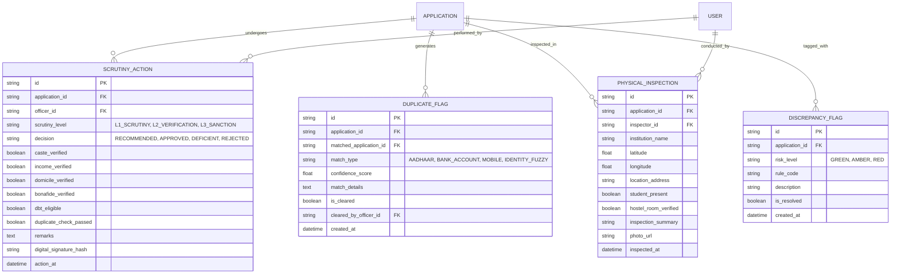

# Phase 5 Implementation Plan: Verification & Scrutiny Engine (Module 5, Features 48–58)

## Executive Summary
Phase 5 implements the **Verification & Scrutiny Engine** operating at the District Welfare Office (DWO), Field Inspection, and State Directorate levels. This module represents the government's statutory scrutiny tier, ensuring that public scholarship funds reach genuine Scheduled Tribe beneficiaries without fraud, duplicates, or ineligible disbursements.

The engine introduces a **3-tier multi-level scrutiny workflow** (L1 Scrutiny Assistant -> L2 District Welfare Officer -> L3 Sanctioning Authority), integrates cross-verification stubs with state revenue databases (Jharsewa/e-District), NFSA ration cards, and UDID disability registries, executes an automated **multi-vector duplicate detection engine**, supports field inspection report uploads, and computes an automated **Red/Amber/Green risk index** before enforcing a mandatory sign-off checklist.

---

## Scope of Features (Features 48–58)

| Feature # | Feature Title | Technical & Domain Specification |
|---|---|---|
| **Feature 48** | **Multi-Level Scrutiny Workflow** | 3-tier hierarchical scrutiny: **L1 Verifier** (Document scrutiny & discrepancy tagging) ➔ **L2 Approver** (DWO verification & spot assessment review) ➔ **L3 Sanctioning Authority** (Directorate final approval & fund allocation). |
| **Feature 49** | **Caste Certificate Verification** | Automated state revenue database cross-check (Jharsewa / e-District / DigiLocker stub) validating certificate number, issuing authority (Tehsildar/SDO), issuance date, and recognized ST sub-caste. |
| **Feature 50** | **Income Certificate Verification** | Revenue Department cross-check verifying annual family income against the income ceiling (e.g. ₹2.50 Lakh for Post-Matric) and checking the 1-year validity period. |
| **Feature 51** | **Domicile / Residential Verification** | District administration database cross-check verifying permanent residency within notified Scheduled Areas / ITDA tribal blocks. |
| **Feature 52** | **Ration Card / Family Registry Cross-Verification** | National Food Security Act (NFSA) database stub verifying ration card number, BPL/AAY status, and family member census. |
| **Feature 53** | **Duplicate Application Detection Engine** | Multi-vector deduplication algorithm checking: (1) Aadhaar hash across current academic year, (2) Bank account / IFSC re-use across different students, (3) Mobile number collisions, (4) Exact Name + Father's Name + DOB collisions. Produces a duplicate confidence score (0–100%). |
| **Feature 54** | **Death of Parent / Guardian Verification** | Civil Registration System (CRS) death registry check for orphan/single-parent ST scholarship quota claims. |
| **Feature 55** | **Disability Certificate Verification (UDID)** | Unique Disability ID (UDID) portal integration verifying benchmark disability percentage (≥ 40% threshold mandated for PwD allowance) and certificate authenticity. |
| **Feature 56** | **Physical Spot Inspection Report Upload** | Module for Field Welfare Inspectors to conduct on-site verification of remote tribal schools and hostels, recording GPS coordinates (lat/long), student presence, photos, and inspection notes. |
| **Feature 57** | **Discrepancy Flagging & Risk Tagging** | Automated risk assessment assigning applicant dossiers **RED** (High Risk: duplicate detected, expired income, sub-caste mismatch), **AMBER** (Moderate Risk: unverified manual upload, income near limit), or **GREEN** (Low Risk: 100% verified digital sources, clean history). |
| **Feature 58** | **Mandatory Verification Checklist & Sign-off** | Interactive verification checklist requiring officers to explicitly confirm all statutory prerequisites (caste, income, bonafide, DBT seeding, no duplicate) before digitally authorizing progression. |

---

## System Architecture & Data Model

### 1. Database Schema (`backend/app/db/models/scrutiny.py`)

### 2. External Integration Stubs (`backend/app/services/scrutiny_integrations.py`)
- `verify_caste_certificate(cert_no, sub_caste)`: Validates against State Revenue (Jharsewa/e-District) repository.
- `verify_income_certificate(cert_no, claimed_income)`: Checks issue date within 12 months & income consistency.
- `verify_domicile_certificate(cert_no, district)`: Verifies state resident registry.
- `verify_ration_card(card_no, student_name)`: Validates against NFSA portal.
- `verify_udid_certificate(udid_number)`: Checks Unique Disability ID registry for ≥ 40% disability.

---

## API Endpoints (`/api/v1/scrutiny`)

| Method | Endpoint | Description |
|---|---|---|
| `GET` | `/applications` | Paginated list of applications pending scrutiny at current officer's level (L1/L2/L3) and jurisdiction district. |
| `GET` | `/applications/{id}/dossier` | Comprehensive scrutiny dossier: student bio, automated risk tags (Red/Amber/Green), duplicate flags, verified certificates, institutional verification stamp. |
| `POST` | `/applications/{id}/cross-verify` | Execute live cross-verification of caste, income, domicile, ration card, or UDID against state registries. |
| `POST` | `/applications/{id}/run-deduplication` | Run multi-vector duplicate detection scan (Aadhaar, Bank, Phone, Fuzzy Name). |
| `POST` | `/applications/{id}/action` | Submit scrutiny decision (L1 Recommendation, L2 DWO Approval, L3 Sanction) with mandatory checklist sign-off and digital seal. |
| `POST` | `/applications/{id}/physical-inspection` | Record field inspector's physical spot inspection report with GPS coordinates and findings. |
| `POST` | `/applications/{id}/clear-duplicate` | Clear or confirm a flagged duplicate with officer justification. |
| `GET` | `/dashboard-stats` | Scrutiny stats: Pending L1, Pending L2, Pending L3, Sanctioned, Deficient, High Risk (Red Flags). |

---

## Frontend User Experience & UI Design (MeitY / UMANG Standard)

1. **Welfare Officer Scrutiny Dashboard (`/officer/scrutiny`)**:
   - Header with jurisdiction badge (e.g. *District Welfare Office, Ranchi - Jharkhand*).
   - 4 High-contrast KPI cards:
     - 📋 **Pending Scrutiny (L1/L2)** (Amber)
     - 🛡️ **Risk Level Alerts (Red / Amber Flags)** (Red)
     - 📍 **Pending Spot Inspections** (Purple)
     - 🏛️ **Sanctioned & Approved** (Emerald Green)
   - Filter & search by District, Risk Level (Red/Amber/Green), Scheme, and Scrutiny Stage.
   - Interactive data table with Risk Badges (`RED - Duplicate Aadhaar`, `AMBER - Manual Upload`, `GREEN - Clean`).

2. **Scrutiny & Verification Dossier Workbench (`/officer/scrutiny/:id`)**:
   - Split layout:
     - **Left Pane (4 cols)**: Student & Family Profile, Institutional Verification Seal, Uploaded Documents with live preview.
     - **Center Pane (5 cols)**:
       - **Automated Verification Status Card**: Real-time cross-verification badges (Caste, Income, Domicile, NFSA, UDID).
       - **Duplicate Detection Panel**: Highlights any matching application numbers, matching bank accounts, or Aadhaar re-use with confidence scores.
       - **Physical Inspection Details**: GPS map coordinates, inspector notes, and timestamp.
       - **Risk Assessment Box**: Red/Amber/Green status with specific rule breakdowns.
     - **Right Pane (3 cols)**:
       - **Mandatory Statutory Checklist (Feature 58)**: Checkboxes for Caste, Income, Bonafide, DBT, No Duplicate.
       - **Decision Controls**: "Recommend / Approve", "Return as Deficient", "Reject".
       - Digital Signing Seal generation.

3. **Field Physical Inspection Modal / Page (`PhysicalInspectionModal.jsx`)**:
   - Inspector credentials, GPS coordinates capture, student attendance status, hostel room allotment check, and inspector notes.

---

## Test Strategy & Quality Assurance (`test_phase5.py`)

Automated tests covering all 11 features:
1. `test_officer_scrutiny_applications_queue`: Filter applications pending L1/L2 scrutiny in officer's jurisdiction.
2. `test_caste_certificate_cross_verification`: Test Jharsewa/e-District stub verification for ST sub-caste.
3. `test_income_certificate_cross_verification`: Test revenue database check and expired income certificate flagging.
4. `test_domicile_and_nfsa_verification`: Test domicile and ration card cross-checks.
5. `test_udid_disability_verification`: Test disability percentage threshold (≥ 40% rule).
6. `test_duplicate_detection_aadhaar_match`: Test duplicate detection engine flagging shared Aadhaar across applications.
7. `test_duplicate_detection_bank_account_reuse`: Test flagging shared bank account number between different applicants.
8. `test_risk_engine_tagging`: Verify assigning RED risk tag on duplicate or expired documents, GREEN on fully verified.
9. `test_physical_spot_inspection_recording`: Test saving field inspector's report with GPS coordinates and findings.
10. `test_mandatory_checklist_enforcement`: Test that scrutiny decision fails if mandatory statutory checkboxes are incomplete.
11. `test_multi_level_scrutiny_progression`: Test L1 recommendation -> L2 approval -> L3 sanction progression with digital stamps.
12. **Full Regression Test**: Execute tests across Phase 1, Phase 2, Phase 3, Phase 4, and Phase 5 to guarantee zero regressions.

---

## Next Steps
Upon user approval of this plan, we will proceed immediately with:
1. Creating database models in `backend/app/db/models/scrutiny.py` and exporting in `__init__.py`.
2. Implementing business logic & integration stubs in `backend/app/services/scrutiny_service.py`.
3. Creating Pydantic schemas in `backend/app/schemas/scrutiny.py`.
4. Implementing API routes in `backend/app/api/v1/endpoints/scrutiny.py` and registering in `api.py`.
5. Building the frontend Scrutiny Dashboard and Officer Verification Workbench.
6. Executing `test_phase5.py` and running the complete 5-phase regression suite.
7. Generating the Phase 5 Walkthrough report.
